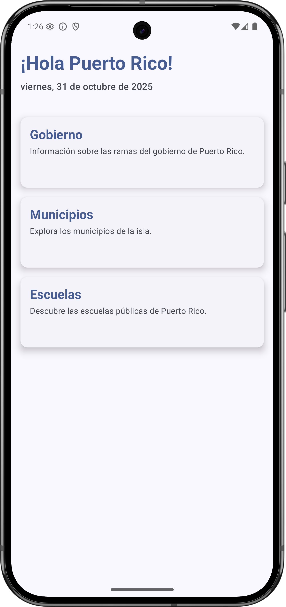
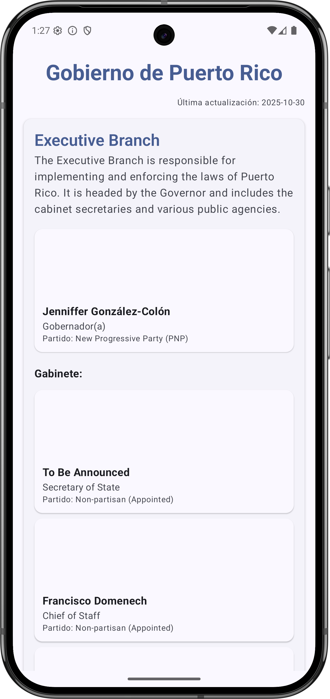
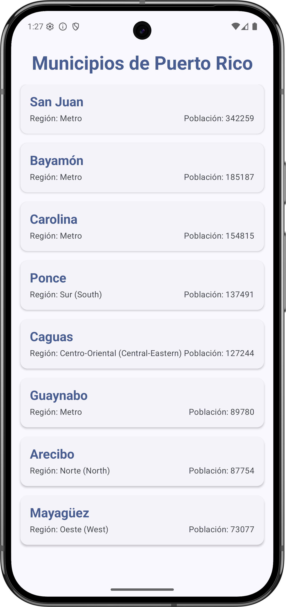
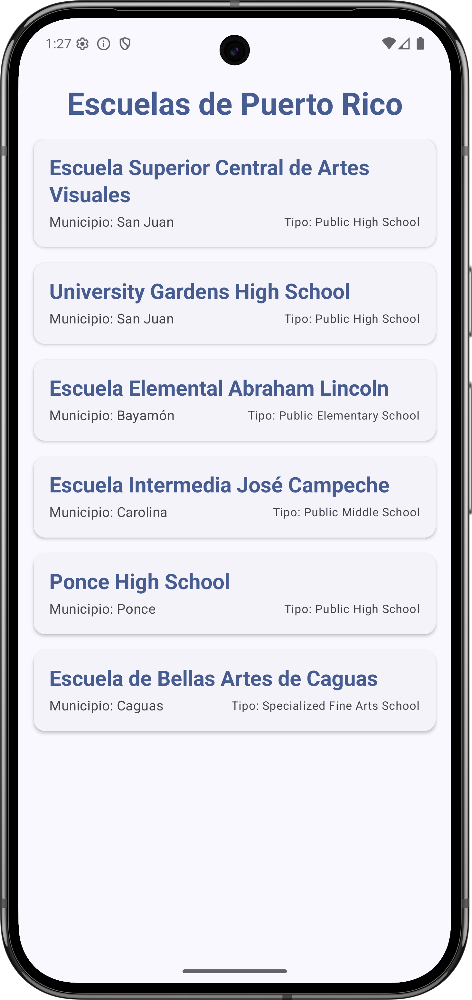

# Android Puerto Rico MVVM

[](https://github.com/joelromanpr/android-puertorico-mvvm/actions/workflows/android.yml)

Welcome to the **Android Puerto Rico MVVM** project! This is an educational Android application designed to showcase modern Android development practices. It serves as a practical, open-source guide for students, professors, and industry professionals interested in learning how to build robust, scalable, and maintainable Android apps.

This project was built with lightning speed thanks to **Gemini** in Android Studio, illustrating how generative AI can accelerate development and help implement best practices efficiently.

## App Screenshots

Here’s a glimpse of the app in action, showcasing its clean and modern UI:

|  |  |
| :-----------------------------------: | :-------------------------------------: |
| *Home Screen*                         | *Government Screen*                     |

|  |  |
| :-----------------------------------------: | :----------------------------------: |
| *Municipalities Screen*                     | *Schools Screen*                     |

## Tech Stack & Core Libraries

This project leverages a modern tech stack to illustrate current best practices in Android development:

- **UI:** [Jetpack Compose](https://developer.android.com/jetpack/compose) for building the UI declaratively.
- **Architecture:** [Model-View-ViewModel (MVVM)](https://developer.android.com/jetpack/guide)
- **Architecture Helper:** `io.github.joelromanpr:android-essentials-arch` to streamline MVVM implementation.
- **Dependency Injection:** [Hilt](https://dagger.dev/hilt/) for managing dependencies.
- **Networking:** [Retrofit](https://square.github.io/retrofit/) for type-safe HTTP requests.
- **Image Loading:** [Coil](https://coil-kt.github.io/coil/) for efficient image loading, including SVG support.
- **Navigation:** [Jetpack Navigation for Compose](https://developer.android.com/jetpack/compose/navigation) for navigating between screens.

## Core Concepts Illustrated

This project demonstrates several key principles of modern Android development:

### 1. MVVM Architecture

We use the **Model-View-ViewModel (MVVM)** pattern to create a clear separation of concerns. This makes the app easier to test, debug, and scale.

- **Model:** Represents the data and business logic. It consists of our data sources (Retrofit API service) and the repository that provides a clean API for the rest of the app.
- **View:** The UI layer (Jetpack Compose screens) that observes the ViewModel for state changes and forwards user actions.
- **ViewModel:** Acts as a bridge between the Model and the View. It holds and processes UI-related data, exposing it as observable state, and handles user actions.

### 2. Building Screens with `android-essentials-arch`

To streamline the MVVM implementation, we leverage the `io.github.joelromanpr:android-essentials-arch` library. This library provides a clear and concise framework for building screens, reducing boilerplate and enforcing a consistent architectural pattern.

Each feature screen follows this structure:

- **Contract:** An interface that defines the `UiState` and `UiAction` for a given screen. This creates a clear and self-documenting API for the feature.

  ```kotlin
  // Example: HomeContract.kt
  interface HomeContract {
      data class HomeUiState(...) : UiState
      sealed class HomeUiAction : UiAction {
          data class NavigateTo(val route: String) : HomeUiAction()
      }
  }
  ```

- **ViewModel:** Extends `EssentialsViewModel` and implements the `onAction` method to handle user interactions. It exposes UI state via a `StateFlow`.

  ```kotlin
  // Example: HomeViewModel.kt
  @HiltViewModel
  class HomeViewModel @Inject constructor() :
      EssentialsViewModel<HomeContract.HomeUiState, HomeContract.HomeUiAction, NavRoutes>() {

      override fun onAction(action: HomeContract.HomeUiAction) {
          when (action) {
              is HomeContract.HomeUiAction.NavigateTo -> { ... }
          }
      }
  }
  ```

- **Screen (Composable):** The Composable function observes the ViewModel's state and calls `onAction` to respond to user input. Navigation is handled reactively by collecting one-shot events from the ViewModel.

  ```kotlin
  // Example: HomeScreen.kt
  @Composable
  fun HomeScreen(
      navigate: (NavRoutes) -> Unit,
      viewModel: HomeViewModel = hiltViewModel()
  ) {
      val state by viewModel.screenState.collectAsState()

      // Collect one-shot navigation events
      HandleNavigationTarget(flow = viewModel.nav.receiveAsFlow(), onEvent = navigate)

      // UI code that observes state and calls viewModel.onAction(...)
  }
  ```

### 3. Powering Data with Retrofit and Hilt

Data is fetched from the [Puerto Rico Government API](https://pr-government-api.web.app/) using **Retrofit**, the type-safe HTTP client for Android and Java.

- **API Service:** A simple interface defines the API endpoints.

  ```kotlin
  interface PuertoRicoApiService {
      @GET("government.json")
      suspend fun getGovernmentData(): GovernmentResponse

      @GET("municipalities.json")
      suspend fun getMunicipalities(): List<Municipality>
  }
  ```

- **Dependency Injection with Hilt:** We use **Hilt** to manage dependencies. This makes our code more modular and testable. Hilt provides the Retrofit instance and the `ImageLoader` for Coil across the app.

  ```kotlin
  // Example: di/NetworkModule.kt
  @Module
  @InstallIn(SingletonComponent::class)
  object NetworkModule {
      @Provides
      @Singleton
      fun provideRetrofit(...): Retrofit { ... }

      @Provides
      @Singleton
      fun providePuertoRicoApiService(retrofit: Retrofit): PuertoRicoApiService { ... }
  }
  ```

### 4. Image Loading with Coil

Images, including SVGs, are loaded efficiently using **Coil**, a modern image loading library for Android. A custom `ImageLoader` is provided via Hilt to enable SVG support automatically.

## Project Structure

The project is organized into the following main packages:

- **`data`**: Contains the data layer, including data models, the Retrofit API service, and the repository.
- **`di`**: Holds the Hilt dependency injection modules.
- **`domain`**: Contains the use cases that encapsulate specific business logic.
- **`navigation`**: Defines the navigation routes and destinations.
- **`presentation`**: Contains the UI layer, with sub-packages for each feature screen (e.g., `home`, `government`).

## Get Started

To build and run the project:

1.  Clone this repository.
2.  Open the project in the latest stable version of Android Studio.
3.  Let Gradle sync the dependencies.
4.  Run the `app` configuration on an emulator or a physical device.

## License

```
MIT License

Copyright (c) 2025 Joel Roman

Permission is hereby granted, free of charge, to any person obtaining a copy
of this software and associated documentation files (the "Software"), to deal
in the Software without restriction, including without limitation the rights
to use, copy, modify, merge, publish, distribute, sublicense, and/or sell
copies of the Software, and to permit persons to whom the Software is
furnished to do so, subject to the following conditions:

The above copyright notice and this permission notice shall be included in all
copies or substantial portions of the Software.

THE SOFTWARE IS PROVIDED "AS IS", WITHOUT WARRANTY OF ANY KIND, EXPRESS OR
IMPLIED, INCLUDING BUT NOT LIMITED TO THE WARRANTIES OF MERCHANTABILITY,
FITNESS FOR A PARTICULAR PURPOSE AND NONINFRINGEMENT. IN NO EVENT SHALL THE
AUTHORS OR COPYRIGHT HOLDERS BE LIABLE FOR ANY CLAIM, DAMAGES OR OTHER
LIABILITY, WHETHER IN AN ACTION OF CONTRACT, TORT OR OTHERWISE, ARISING FROM,
OUT OF OR IN CONNECTION WITH THE SOFTWARE OR THE USE OR OTHER DEALINGS IN THE
SOFTWARE.
```
